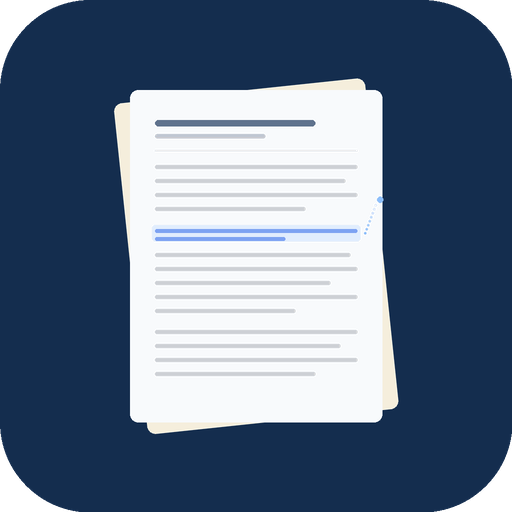

# Dualread Paper

<p align="center">
  
</p>

<p align="center">
  英語論文を文単位で日本語訳を確認しながら読めるデスクトップアプリ
</p>

---

## 概要

[`/paper-translate`](https://github.com/Davinci-Meg/claude-code-commands) で翻訳した英語論文を、原文の文をクリックするだけで対応する日本語訳を確認できるビューアです。

- 文をクリック → サイドパネルに翻訳を表示
- 用語集（glossary）で専門用語の対訳を検索
- 論文内の図表をインライン表示
- 翻訳済み論文をライブラリとして一覧管理

## スクリーンショット

```
┌─────────────────────────────────┬──────────────────────┐
│  Attention Is All You Need      │  翻訳                │
│                                 │                      │
│  ── Abstract ──                 │  ▸ 原文:             │
│  The dominant sequence          │  "The dominant..."   │
│  transduction models are based  │                      │
│  on complex recurrent or        │  ▸ 翻訳:             │
│  convolutional neural networks  │  「主流のシーケンス    │
│  that include an ← クリック     │   変換モデルは...」    │
│                                 │                      │
│  ── 1. Introduction ──          │  ── 関連用語 ──       │
│  Recurrent neural networks...   │  encoder → エンコーダ │
│                                 │  decoder → デコーダ   │
└─────────────────────────────────┴──────────────────────┘
```

## 使い方

### 1. 論文を翻訳する

Claude Code で `/paper-translate` スキルを使って論文PDFを翻訳します。

```bash
/paper-translate ~/Downloads/attention_is_all_you_need.pdf
```

以下のファイルが生成されます:

```
Attention Is All You Need/
├── paper.md           # 原文（英語Markdown）
├── paper.ja.md        # 翻訳（日本語Markdown）
├── glossary.md        # 用語対訳表
├── images/            # 抽出した図表
└── ...
```

### 2. アプリで読む

Dualread Paper を起動し、翻訳済み論文のフォルダをライブラリとして設定します。

- **ライブラリ画面**: 翻訳済み論文がカードとして一覧表示
- **閲覧画面**: 文をクリック → 右パネルに日本語訳
- **キーボード操作**: `↑`/`↓` で前後の文に移動、`Esc` で選択解除

### スタンドアロン版

デスクトップアプリをインストールせずに使いたい場合は、`viewer.html` をブラウザで開き、翻訳フォルダをドラッグ＆ドロップしても使えます。

## 開発

### 必要環境

- [Rust](https://rustup.rs/) 1.77+
- [Node.js](https://nodejs.org/) 20+
- Windows: [Visual Studio C++ Build Tools](https://visualstudio.microsoft.com/visual-cpp-build-tools/) + WebView2

### セットアップ

```bash
git clone https://github.com/Davinci-Meg/dualread-paper.git
cd dualread-paper
npm install
npx tauri dev
```

### ビルド

```bash
npx tauri build
```

`src-tauri/target/release/bundle/` にインストーラーが生成されます。

## アーキテクチャ

```
Frontend (Vanilla JS + Vite)        Backend (Rust + Tauri v2)
├── src/main.js        ルーティング    ├── commands.rs  ライブラリスキャン/ファイル読み込み
├── src/views/library.js  一覧画面    ├── watcher.rs   フォルダ監視 (notify crate)
├── src/views/reader.js   閲覧画面    └── lib.rs       プラグイン登録
├── src/lib/converter.js  MD→データ変換
├── src/lib/fs-bridge.js  Tauri IPC
└── src/lib/store.js      設定永続化
```

## ライセンス

MIT
